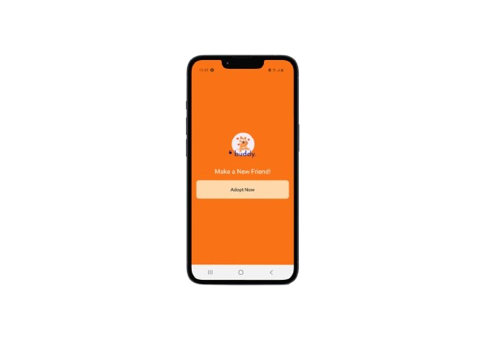

# Buddy
Buddy Mobile App.

# Features
* Pet Profiles
* Lost and Found Pets
* Social Feed
* Pet Business
* Pet Care

# Course Overview
* Basic React Native Components
* Database Design using Appwrite
* User Registration & Authenticaiton
* Deployment

# Tech Stack
* React Native
* AppWrite
* HTML, CSS and JS

# Home Screen
  

# Sign Up Screen
  

# Sign In Screen
  

# Tab Screen
  

# Walkthrough
 
[Buddy App Walkthrough](https://youtu.be/3cp9ENcwr6g)

Ready to dive into the code? This walkthrough will take you behind the scenes, showcasing key project files like (𝗮𝘂𝘁𝗵) and (𝘁𝗮𝗯𝘀), and highlighting important components like 𝗖𝘂𝘀𝘁𝗼𝗺𝗕𝘂𝘁𝘁𝗼𝗻 and 𝗙𝗼𝗿𝗺𝗙𝗶𝗲𝗹𝗱. Let's explore how these building blocks come together to create this app!